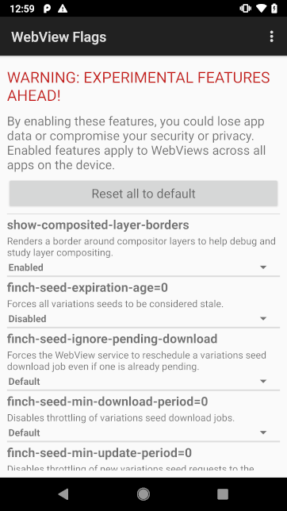

# Flag UI

While WebView supports [toggling arbitrary flags](commandline-flags.md) on
debuggable devices, we also support toggling a curated set of experimental
flags/features on production Android devices. We expose these features as part
of WebView's on-device DevTools. This is similar to Chrome's `chrome://flags`
tool.

## Using the flag UI

This feature is launching soon! Until then, Googlers can follow instructions in
[this email thread](http://shortn/_Whbt0gWDS9).

<!-- TODO(ntfschr): fill this out when Dev UI launches (https://crbug.com/1002589)-->

## Adding your flags and features to the UI

If you're intending to launch a feature in WebView or start a field trial (AKA
Finch experiment), we **highly encourage** you to [add to the
list](/android_webview/java/src/org/chromium/android_webview/common/ProductionSupportedFlagList.java)
(ex. [CL](https://crrev.com/c/2008007), [CL](https://crrev.com/c/2066144)).

Exposing your feature this way has several benefits:

- This improves the manual test process. Testers can enable your feature with a
  button click instead of an adb command.
- Typo-free: someone could mistype a flag or feature name in the commandline,
  but this UI ensures flag names are always spelled correctly.
- Because this works on production Android devices, test team can validate your
  feature on devices from other OEMs.
- You (and teammates) can dogfood your feature.
- If users or third-party app developers report bugs, this UI is the only way
  they can toggle your feature to help root-cause the regression.

## See also

- [Design doc](http://go/webview-dev-ui-flags-design) (Google-only)
